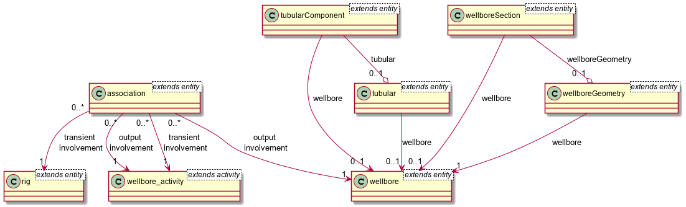

# Schema Service

- [Introduction](#introduction)
- [Concepts](#concepts)
- [How to use this service?](#using_this_service)
- [Current limitation](#limitation)
- [Schema Validation](#schema-validation)
- [Version info endpoint](#version-info-endpoint)


## Introduction <a name="introduction"></a>
Schema Service enables a centralized governance and management of schema in the Data Ecosystem. It offers an implementation of the schema standard. 
Schema Service provides all necessary APIs to Fetch, create, update and mark a schema obsolete.


## Concepts <a name="concepts"></a>
* Schema - A data model definition. Schema Service allows data models to be defined in rich JSON objects (as per JSON schema specifications JSON Schema [draft #07](https://json-schema.org/understanding-json-schema/index.html)).
* Schema Resolution - Schema definitions could include references to other schema definitions or fragments. During Schema creation, Schema Service resolves all the referred schema fragments and creates a completely resolved schema. A sample entity-relationship diagram below demonstrates the associations between various domain entities and how schema fragment references can be helpful in defining models for these entities.

* Schema Uniqueness - A schema is uniquely identified by the schema identity information. The identity information includes authority, source, entity type, major version, minor version and patch version. These attributes are used to generate the kind and id of the schema
* Schema Scope - Schema defined with Schema Service has a defined `scope`. Scope values could be SHARED or INTERNAL. PUBLIC scope may get introduced in future versions.
    * **INTERNAL** - Schema with INTERNAL scope are defined in a specific data partition and is available only to the users of that data partition.
    * **SHARED** - Concept of sharing of schema is intended to allow creator of schema, to share a schema with other friend data partition. In current version a user of Schema Service cannot explicitly share an INTERNAL schema. Certain standards schema are available out of box with all data partitions on the Data Ecosystem. So these are the ones that are shared by default.
    * PUBLIC - Not available currently. In future, could include community approved and governed schema that would, by default be available in the entire data platform.
* Schema Status - Schema defined with Schema Service could be in one of the following `status` values:
    * **PUBLISHED** - When a schema is created it could be set to PUBLISHED status. Or a schema in DEVELOPMENT status can be moved to a PUBLISHED status. A Schema in PUBLISHED status is immutable.
    * **DEVELOPMENT** - Schema in draft or evolutionary status. This status is usually set when schema definition is work in progress.Schema in DEVELOPMENT status is mutable.
    * **OBSOLETE** - Schema when no longer in use or not needed can be marked as OBSOLETE. Only Schema in DEVELOPMENT status can be moved to OBSOLETE status.
* Semantic Schema versioning - Schema definitions are expected to be semantically versioned. Major, Minor and Patch versions are part of Schema identity information. Schema service does check for breaking changes across the schema(s) being created. And if a breaking change is found, it prompts the user to change the major version of the schema.
* Schema Vs Storage Schema

| Schema defined with Schema Service                                   | Schema defined with Storage Schema Service             |
|----------------------------------------------------------------------|--------------------------------------------------------|
| Rich JSON Objects as per JSON Schema draft#07                        | Flattened JSON having an array of attributes           |
| Being JSON object allows defining real entity model                  | Schema definition does not support this                |
| Schema fragments can be referred within the definition               | Schema definition does not support this                |
| Intended for central governance for all schema defined in the system | Intended primarily for discovery and searching of data |


## How to use this service? <a name="using_this_service"></a>

The Schema Service promotes re-use and composition via the JSON schema draft 07 features. Typically one would start
with the registration of reusable schema fragments or schema elements, which are used e.g. by API specifications or
other schemas.

Then these schema fragments can be referenced and included in more complex constructs up to actual record schemas
for Storage.

The example below defines a schema fragment defining a map position having a latitude and a longitude.  

<details><summary>Schema Fragment Example, 2D Map position</summary>

```json
{
  "schemaInfo": {
    "schemaIdentity": {
      "authority": "slb",
      "source": "wks",
      "entityType": "mapPosition",
      "schemaVersionMajor": 1,
      "schemaVersionMinor": 0,
      "schemaVersionPatch": 0,
      "id": "slb:wks:mapPosition:1.0.0"
    },
    "createdBy": "Schlumberger",
    "scope": "SHARED",
    "status": "DEVELOPMENT"
  },
  "schema": {
    "description": "A 2D point location in latitude and longitude referenced to WGS 84 if not specified otherwise.",
    "properties": {
      "latitude": {
        "description": "The latitude value in degrees of arc (dega). Value range [-90, 90].",
        "title": "Latitude",
        "type": "number",
        "minimum": -90,
        "maximum": 90
      },
      "longitude": {
        "description": "The longitude value in degrees of arc (dega). Value range [-180, 180]",
        "title": "Longitude",
        "type": "number",
        "minimum": -180,
        "maximum": 180
      }
    },
    "required": [
      "latitude",
      "longitude"
    ],
    "title": "2D Map Location",
    "type": "object"
  }
}    
```

</details>

Eventually a Storage record schema will be created. It will use a variety of other standard 
schema fragments, which are boiler-plate record properties. An example record schema is given 
in the following example:

<details><summary>Storage Record Schema Example for a PointOfInterest Record</summary>

```json
{
  "schemaInfo": {
    "schemaIdentity": {
      "authority": "slb",
      "source": "wks",
      "entityType": "pointOfInterest",
      "schemaVersionMajor": 1,
      "schemaVersionMinor": 0,
      "schemaVersionPatch": 0,
      "id": "slb:wks:pointOfInterest:1.0.0"
    },
    "createdBy": "Schlumberger",
    "scope": "SHARED",
    "status": "DEVELOPMENT"
  },
  "schema": {
    "$schema": "http://json-schema.org/draft-07/schema#",
    "title": "Point Of Interest",
    "description": "A Point of Interest data association a textual label with a description to a 2D map position.",
    "type": "object",
    "properties": {
      "id": {
        "description": "The entity ID which identifies this OSDU resource object without version.",
        "title": "Entity ID",
        "type": "string",
        "example": "someDataPartitionId:dataSourceNamespace:pointOfInterest:unique-id-3680fceb-bfef-4027-abba-6e580f6d212e"
      },
      "kind": {
        "description": "The schema identification for the DELFI/OSDU resource object following the pattern <Namespace>:<Source>:<Type>:<VersionMajor>.<VersionMiddle>.<VersionMinor>",
        "title": "Kind",
        "default": "slb:wks:pointOfInterest:1.0.0",
        "type": "string",
        "pattern": "[A-Za-z0-9-_]+:[A-Za-z0-9-_]+:[A-Za-z0-9-_]+:[0-9]+.[0-9]+.[0-9]+"
      },
      "version": {
        "description": "The version number of this OSDU resource; set by the framework.",
        "title": "Version Number",
        "type": "integer",
        "format": "int64",
        "example": "1831253916104085"
      },
      "acl": {
        "description": "The access control tags associated with this entity.",
        "title": "Access Control List",
        "$ref": "slb:wks:accessControlList:1.0.0"
      },
      "legal": {
        "description": "The entity's legal tags and compliance status.",
        "title": "Legal Tags",
        "$ref": "slb:wks:AbstractLegalTags:1.0.0"
      },
      "ancestry": {
        "description": "The links to data, which constitute the inputs.",
        "title": "Ancestry",
        "$ref": "slb:wks:AbstractLegalParentList:1.0.0"
      },
      "meta": {
        "description": "The meta data section linking the 'unitKey', 'crsKey' to self-contained definitions.",
        "title": "Frame of Reference Meta Data",
        "type": "array",
        "items": {
          "$ref": "slb:wks:metaItem:1.0.0"
        }
      },
      "data": {
        "$ref": "#/definitions/data"
      }
    },
    "required": [
      "kind",
      "acl",
      "legal"
    ],
    "definitions": {
      "relationships": {
        "description": "All relationships from this Point of Interest.",
        "properties": {
          "relatedItems": {
            "description": "Any entities related to this entity.",
            "$ref": "slb:wks:toManyRelationship:1.0.0",
            "title": "Related Entities"
          }
        },
        "title": "Relationships",
        "type": "object"
      },
      "data": {
        "type": "object",
        "title": "Point of Interest",
        "description": "",
        "properties": {
          "description": {
            "description": "The textual description for this point of interest.",
            "example": "Proposed Drilling Location",
            "title": "Description",
            "type": "string"
          },
          "additionalURL": {
            "description": "An optional URL leading to more contextual information.",
            "example": "https://www.bigoil.com/internal/campaigns/area/Drilling2021/plannedLocation.html",
            "title": "Additional URL",
            "type": "string"
          },
          "location": {
            "description": "The 2D map location of the Point of Interest",      
            "title": "Location",
            "$ref": "slb:wks:mapPosition:1.0.0"
          },
          "relationships": {
            "description": "The related entities.",
            "$ref": "#/definitions/relationships",
            "title": "Relationships"
          }
        }
      }
    }
  }
}
```

</details>

As the example demonstrates, the record schema is composed of a number of schema fragments, which are
included by `$ref` and the schema identity, e.g. `slb:wks:mapPosition:1.0.0` for the `location` 
property. All the referenced schema fragments must have been registered prior to the new schema
`slb:wks:pointOfInterest:1.0.0`.


The following parameters are required to create a schema: 


| Attribute          | Use                                               | Example                                  | Datatype | Required (Yes/No) |
|--------------------|---------------------------------------------------|------------------------------------------|----------|-------------------|
| authority          | Authority defining the schema                     | authority: "slb"                         | String   | Yes               |
| source             | Source from data of the given schema is expected. | source: "prosource"                      | String   | Yes               |
| entityType         | Entity Type for which the schema is being defined | entityType: "wellbore"                   | String   | Yes               |
| schemaVersionMajor | Major version of the schema                       | schemaVersionMajor: 1                    | String   | Yes               |
| schemaVersionMinor | Minor version of the schema                       | schemaVersionMinor : 0                   | String   | Yes               |
| schemaVersionPatch | Patch version of the schema                       | schemaVersionPatch : 0                   | String   | Yes               |
| schema             | Schema definition                                 | JSON object. Please refer example above. | Object   | No                |


## Schema Validation <a name="schema-validation"></a>

Schema service does multiple checks on different levels to make sure the inserted schema fits into validations on major, minor and patch version levels.
Following is the list of all validations that is performed while creating/updating any schema into the system.

Schema version constitutes three parts, MAJOR, MINOR, and PATCH. Depending upon the nature of changes done to the structure of schema, the application may force the user to update the version number. At a high level, the upgrading versions would be required when:
  * PATCH version when you make backwards compatible bug fixes or documentation/decoration changes
  * MINOR version when you add functionality or contents in a backwards compatible manner, and
  * MAJOR version when you make incompatible schema changes. e.g.Whenever an attribute is removed or `type` of an attribute is updated
  
##### Permitted Changes for PATCH Version Increments:

Changes in the values of following attributes is permitted at patch version increment. They are non-mandatory attributes so addition or removal of any of these attributes is permitted.
  * title
  * description
  * example/examples
  * pattern
  * $id
  * $comment
  * any JSON extension tag starting with x-osdu

##### Permitted Changes for MINOR Version Increments: 

In addition to all permitted changes in PATCH versions, the following actions are permitted:
1. Adding properties to existing data and nested structures
2. Adding object structures to below arrays:
  * [allOf](https://json-schema.org/understanding-json-schema/reference/combining.html#allof) : To validate against `allOf`, the given data must be valid against all of the given subschemas
  * [oneOf](https://json-schema.org/understanding-json-schema/reference/combining.html#oneof) : To validate against `oneOf`, the given data must be valid against exactly one of the given subschemas
  * [anyOf](https://json-schema.org/understanding-json-schema/reference/combining.html#anyof) : To validate against `anyOf`, the given data must be valid against any (one or more) of the given subschemas
3. Changing the indices of objects containing title inside `oneOf` or `allOf` arrays
4. Changing indices of ref attributes keeping same text values
5. Changing the order of required attribute

Explicitly not permitted is changing
1. The list of [required](https://json-schema.org/understanding-json-schema/reference/object.html#required-properties) properties
2. The state of [additionalProperties](https://json-schema.org/understanding-json-schema/reference/object.html#additional-properties)
  * If `additionalProperties` is not present in original schema then it cannot be added with value as false
  * If `additionalProperties` is present with value equal to false then cannot be removed/altered
  * Value of `additionalProperties` cannot be changed from true to false
3. Changing type of any attribute

It is permitted to declare existing properties as deprecated, preferable with instructions how to migrate from the previous to the next version. The documentation will automatically mark properties with strike-through if the description starts with "DEPRECATED: " .

##### Permitted Changes for MAJOR Version Increments:
	
Any changes are permitted, specifically
1. Removal of properties
2. Removal of structures in `allOf`, `oneOf`, `anyOf`
3. Changing the list of required properties
4. Changing the state of additionalProperties
5. Changing the indices of attributes without title in `oneOf` and `allOf` arrays
6. Changing type of any attribute
7. Breaking change introduced in external schema of `ref` attribute

Following table gives you error message when breaking change is introduced at any level:

##### Error codes along with message

| Error Code | Condition                                               | Error Message |
|------------|---------------------------------------------------------|---------------|
| 400        | When breaking change not allowed at patch version level |Patch version validation failed. Changes requiring a minor or major version increment were found; analysed version: 2.2.15 and 2.2.14. Updating the schema version to a higher minor or major version is required.|
| 400        | When breaking change not allowed at minor version level |  Minor version validation failed. Breaking changes were found; analysed versions 1013.2.0 and 1013.1.0. Updating the schema version to a higher major version is required.|

Note: The above array message would contain given schema version and existing schema in the system


## Version info endpoint
For deployment available public `/info` endpoint, which provides build and git related information.
#### Example response:
```json
{
    "groupId": "org.opengroup.osdu",
    "artifactId": "storage-gc",
    "version": "0.10.0-SNAPSHOT",
    "buildTime": "2021-07-09T14:29:51.584Z",
    "branch": "feature/GONRG-2681_Build_info",
    "commitId": "7777",
    "commitMessage": "Added copyright to version info properties file",
    "connectedOuterServices": [
      {
        "name": "elasticSearch",
        "version":"..."
      },
      {
        "name": "postgresSql",
        "version":"..."
      },
      {
        "name": "redis",
        "version":"..."
      }
    ]
}
```
This endpoint takes information from files, generated by `spring-boot-maven-plugin`,
`git-commit-id-plugin` plugins. Need to specify paths for generated files to matching
properties:
- `version.info.buildPropertiesPath`
- `version.info.gitPropertiesPath`

[Back to table of contents](#TOC)
