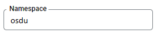
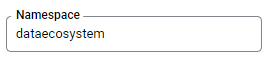

## Service Configuration for Google Cloud

## Environment variables

Define the following environment variables.

Must have:

| name | value | description | sensitive? | source |
| ---  | ---   | ---         | ---        | ---    |
| `SPRING_PROFILES_ACTIVE` | ex `gcp` | Spring profile that activate default configuration for Google Cloud environment | false | - |
| `SHARED_TENANT_NAME` | ex `osdu` | Shared account id | no | - |

Defined in default application property file but possible to override:

| name                                             | value                                         | description                                                             | sensitive? | source                                                       |
|--------------------------------------------------|-----------------------------------------------|-------------------------------------------------------------------------|------------|--------------------------------------------------------------|
| `LOG_PREFIX`                                     | `schema`                                      | Logging prefix                                                          | no         | -                                                            |
| `LOG_LEVEL`                                      | `DEBUG`                                       | Logging level                                                           | no         | -                                                            |
| `SERVER_SERVLET_CONTEXPATH`                      | `/api/schema-service/v1`                      | Servlet context path                                                    | no         | -                                                            |
| `AUTHORIZE_API`                                  | ex `https://entitlements.com/entitlements/v1` | Entitlements API endpoint                                               | no         | output of infrastructure deployment                          |
| `PARTITION_API`                                  | ex `http://localhost:8081/api/partition/v1`   | Partition service endpoint                                              | no         | -                                                            |
| `GOOGLE_APPLICATION_CREDENTIALS`                 | ex `/path/to/directory/service-key.json`      | Service account credentials, you only need this if running locally      | yes        | <https://console.cloud.google.com/iam-admin/serviceaccounts> |
| `SCHEMA_CHANGED_MESSAGING_ENABLED`               | `true` OR `false`                             | Allows to configure message publishing about schemas changes to Pub/Sub | no         | -                                                            |
| `SCHEMA_CHANGED_TOPIC_NAME`                      | `schema-changed`                              | Topic for schema changes events                                         | no         | -                                                            |
| `PARTITION_PROPERTIES_SCHEMA_BUCKET_NAME`        | ex `schema.bucket.name`                       | name of partition property for schema bucket name value                 | yes        | -                                                            |
| `PARTITION_PROPERTIES_SYSTEM_SCHEMA_BUCKET_NAME` | ex `system.schema.bucket.name`                | name of partition property for system schema bucket name value          | yes        | -                                                            |

These variables define service behavior, and are used to switch between `Reference` or `Google Cloud` environments, their overriding
and usage in mixed mode was not tested. Usage of spring profiles is preferred.

| name | value | description | sensitive? | source |
| ---  | ---   | ---         | ---        | ---    |
| `PARTITION_AUTH_ENABLED` | ex `true` or `false` | Disable or enable auth token provisioning for requests to Partition service | no | - |
| `OQMDRIVER` | `rabbitmq` or `pubsub` | Oqm driver mode that defines which message broker will be used | no | - |
| `OSMDRIVER` | `datastore` or `postgres` | Osm driver mode that defines which KV storage will be used | no | - |
| `OBMDRIVER` | `gcs` or `minio` | Obm driver mode that defines which object storage will be used | no | - |
| `SERVICE_TOKEN_PROVIDER` | `GCP` or `OPENID` |Service account token provider, `GCP` means use Google service account `OPEIND` means use OpenId provider like `Keycloak` | no | - |

## Partition level config

### Non-sensitive partition properties
| name                                        | value                          | description                          | sensitive? | source                                           |
|---------------------------------------------|--------------------------------|--------------------------------------|------------|--------------------------------------------------|
| `<SCHEMA_BUCKET_NAME_PROPERTY_NAME>`        | ex `schema.bucket.name`        | schema address in OBM storage        | no         | `PARTITION_PROPERTIES_SCHEMA_BUCKET_NAME`        |
| `<SYSTEM_SCHEMA_BUCKET_NAME_PROPERTY_NAME>` | ex `system.schema.bucket.name` | system schema address in OBM storage | no         | `PARTITION_PROPERTIES_SYSTEM_SCHEMA_BUCKET_NAME` |

## Testing

### Running E2E Tests

This section describes how to run cloud OSDU E2E tests (testing/schema-test-core).

You will need to have the following environment variables defined.

| name | value | description | sensitive? | source |
| ---  | ---   | ---         | ---        | ---    |
| `VENDOR` | `gc` | Use value 'gc' to run Google Cloud tests | no | - |
| `HOST` | ex`http://localhost:8080` | Schema service host | no | - |
| `INTEGRATION_TESTER` | `********` | Service account base64 encoded string for API calls. Note: this user must have entitlements configured already | yes | <https://console.cloud.google.com/iam-admin/serviceaccounts> |
| `PRIVATE_TENANT2` | ex`opendes` | OSDU tenant used for testing | no | - |
| `PRIVATE_TENANT1` | ex`osdu` | OSDU tenant used for testing | no | - |
| `SHARED_TENANT` | ex`common` | OSDU tenant used for testing | no | - |

**Entitlements configuration for integration accounts**

| INTEGRATION_TESTER |
| ---  |
| users<br/>service.schema-service.system-admin<br/>service.entitlements.user<br/>service.schema-service.viewers<br/>service.schema-service.editors<br/>data.integration.test<br/>data.test1 |

Execute following command to build code and run all the integration tests:

 ```bash
 # Note: this assumes that the environment variables for integration tests as outlined
 #       above are already exported in your environment.
 # build + install integration test core
 $ (cd testing/schema-test-core/ && mvn clean test)
 ```

## Datastore configuration

### For private tenants:

There must be a namespace `<data-partition-id>`

Example:



Kind `schema_osm` `authority` `entityType` `source` will be created by service if it does not exist.

### For shared tenant:

There must be a namespace `dataecosystem`.

Example:




Kind `system_schema_osm` `system_authority` `system_entityType` `system_source` will be created by service if it does not exist.

## Pubsub configuration

At Pubsub should be created topic with name:

**name:** `schema-changed`

It can be overridden by:

- through the Spring Boot property `gcp.schema-changed.topic-name`
- environment variable `GCP_SCHEMA_CHANGED_TOPIC_NAME`

Schema service responsible for publishing only.
Consumer side `schema-changed` topic configuration located in
[Indexer Google Cloud PubSub documentation](https://community.opengroup.org/osdu/platform/system/indexer-service/-/tree/master/provider/indexer-gc/docs/gc#pubsub-configuration)

## GCS configuration <a name="ObjectStoreConfig"></a>

For each private tenant:

At Google cloud storage should be created bucket:

<table>
  <tr>
   <td>Bucket Naming template
   </td>
   <td>Permissions required
   </td>
  </tr>
  <tr>
   <td>&lt;PartitionInfo.projectId-PartitionInfo.name><strong>-schema</strong>
   </td>
   <td>ListObjects, CRUDObject
   </td>
  </tr>
</table>

For shared tenant only:

At Google cloud storage should be created bucket:

<table>
  <tr>
   <td>Bucket Naming template
   </td>
   <td>Permissions required
   </td>
  </tr>
  <tr>
   <td>&lt;PartitionInfo.projectId-PartitionInfo.name><strong>-system-schema</strong>
   </td>
   <td>ListObjects, CRUDObject
   </td>
  </tr>
</table>

## Google cloud service account configuration

TBD

| Required roles |
| ---    |
| - |
